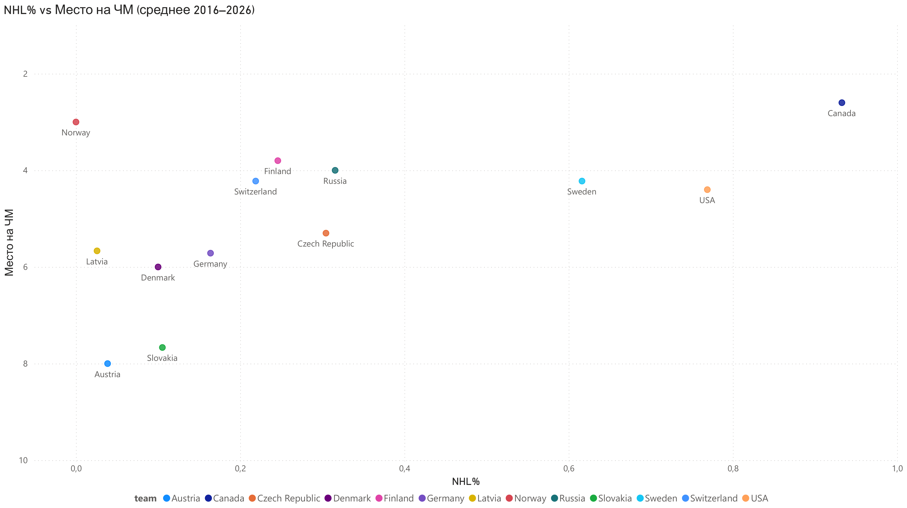
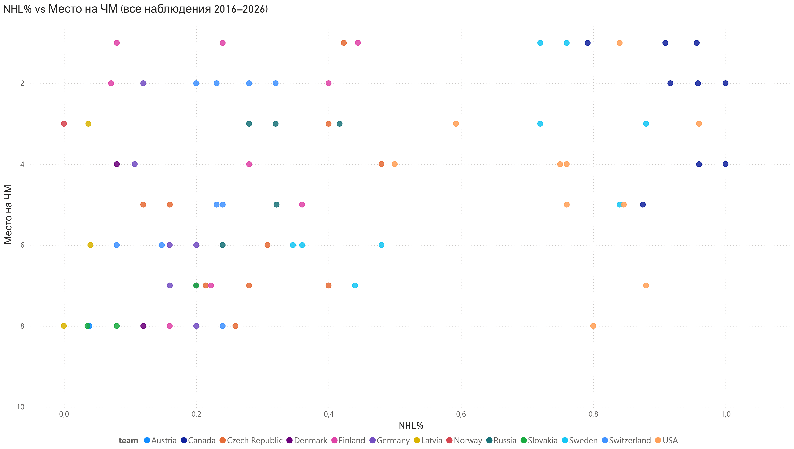
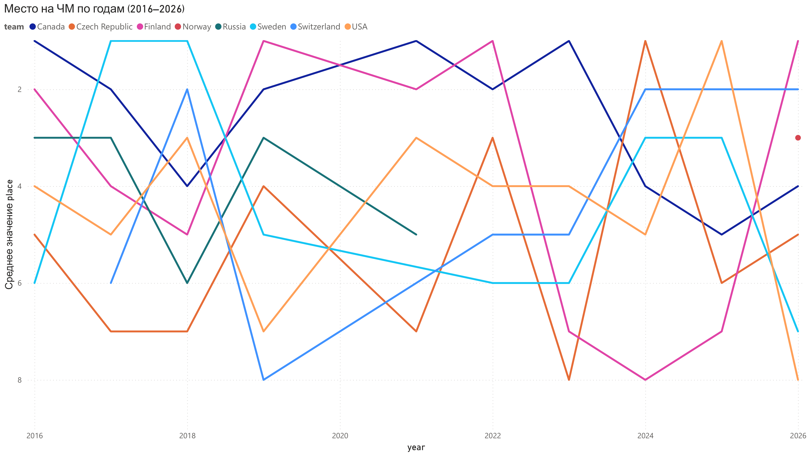

# 🏒 НХЛ и ЧМ: влияет ли десант из НХЛ на результат сборной?

Идея этого проекта появилась случайно — пока я думал над темой для первого pet-проекта,
увидел новость: США проиграли Латвии на ЧМ 2026. Сразу возник вопрос: *а сколько вообще
игроков НХЛ приехало на этот турнир?* Так и началось.

## Что исследовал

Зависимость между долей НХЛ-игроков в составе сборной и её итоговым местом на ЧМ.
Данные охватывают 8 сборных за 10 лет (2016–2026) — 80 наблюдений.

## Методология

Проект охватывает 8 сборных — Канада, США, Финляндия, Швеция, 
Чехия, Швейцария, Германия, Словакия — которые стабильно входят в топ-8 ЧМ 
и имеют значимое представительство в НХЛ.

Сборные ниже восьмёрки намеренно исключены: это нехоккейные страны 
с 1-2 игроками НХЛ на весь состав. Считать влияние НХЛ на их 
результат — всё равно что измерять влияние вентилятора на скорость 
ветра. Групповой этап ЧМ отсеивает таких участников, реальный 
хоккей начинается в плей-офф — именно там и сосредоточен анализ.

## Контекст

НХЛ — сильнейшая хоккейная лига мира, где собраны лучшие игроки 
со всего мира. Высокая конкуренция поднимает уровень каждого — 
даже средний энхаэловец по классу превосходит большинство игроков 
европейских лиг. Поэтому чем больше таких игроков в сборной — 
тем выше её общий класс.

Но есть нюанс: ЧМ проходит в мае, когда в НХЛ идёт плей-офф 
Кубка Стэнли. Пока твой клуб не вылетел — ты не можешь поехать 
на сборную. Поэтому состав сборной каждый год зависит от того, 
как далеко прошли клубы с её игроками.

## Гипотезы — все подтвердились

**Гипотеза 1:** чем больше НХЛ-игроков в составе — тем выше место на ЧМ
→ корреляция **-0.387** ✅

**Гипотеза 2:** чем позже заканчивается 1-й раунд плей-офф НХЛ — тем меньше игроков
приезжает на ЧМ → корреляция **-0.336** ✅

## Визуализация

**NHL% vs Место на ЧМ (средние по командам)**

**NHL% vs Место на ЧМ (все 80 наблюдений)**

**Динамика мест на ЧМ по годам (топ-8 сборных)**

## Главные инсайты

**Канада и США** — практически всегда 80–100% НХЛ-игроков в составе. Исключение — 2021 год:
из-за COVID плей-офф сдвинулся, NHL% Канады упал до 79%, США до 59%. Результаты просели.

**Финляндия** — самый интересный аутлер в данных. При ~30% НХЛ-игроков финны 
стабильно входят в топ-4, а в 2019–2022 доминировали в мировом хоккее 
(два золота ЧМ, золото Олимпиады-2022). Секрет — единая национальная система 
подготовки "Meidän Peli" («Наша игра»): все клубы и сборные работают по одной 
философии, поэтому игроки понимают друг друга без лишних тренировок вместе. 
Примерный аналог в футболе — «Барселона» с её «Ла Масией» и сборная Испании 
эпохи тики-таки.

**Норвегия 2026** — бронза при почти нулевом NHL%. Полная противоположность общей тенденции.
Хочется разобраться что за этим стоит — состав, тренер, турнирная сетка?

**Россия** — отстранена от ЧМ после 2022 года, в датасете учтено.

## Ограничения

80 наблюдений — выборка средняя, выводы носят характер 
тенденции, а не закона.

Корреляция умеренная (-0.387) — NHL% объясняет результат 
частично. Остальное: тренер, состав, форма, сетка плей-офф.

2021 год — аномальный из-за COVID, сдвинутый календарь мог 
повлиять на форму игроков. Данные за этот год могут искажать 
общую картину.

С 2022 года от ЧМ отстранены Россия и Беларусь — это меняет 
конкурентный баланс в топ-8 и частично влияет на чистоту 
сравнений до и после 2022 года.

## Выводы

Игроки из НХЛ влияют на результат сборной — это подтверждается 
цифрами. Но высокий NHL% не гарантирует медаль. Канада и США 
каждый год выходят на ЧМ с составом на 80–100% из энхаэловцев, 
однако результаты нестабильны: Канада — золото в 2023, четвёртое 
место в 2026. США — первое в 2025, восьмое в 2026.

При этом Финляндия с ~30% НХЛ-игроков стабильно входит в топ 
и дважды выигрывала ЧМ в 2019–2022. Секрет не в звёздах, 
а в системе — единая философия подготовки делает сборную 
командой вне зависимости от состава.

Вывод: NHL% создаёт потолок возможностей. Но финальный результат 
определяет тренер — сможет ли он воспользоваться ресурсами 
и создать химию внутри команды.

## Что дальше

1. **Сравнение метрик НХЛ vs Европа** — взять лучших игроков 
сборных из НХЛ и европейских лиг и сравнить статистику по 
позициям. Покажет реальный разрыв в классе между лигами.

2. **Фактор тренера** — влияет ли стабильность тренерского 
штаба на результат? Сравнить сборные с многолетним тренером 
против тех, где специалисты меняются каждые 1-2 года.

3. **Феномен Финляндии** — подробный разбор системы Meidän Peli 
и почему командная химия работает лучше звёздного состава.

4. **Феномен Норвегии 2026** — что изменилось перед турниром 
и какие факторы позволили сборной прыгнуть выше головы.

## Структура репозитория

| Файл | Описание |
|------|----------|
| `hockey_analysis_final.ipynb` | Основной ноутбук: сбор → очистка → анализ |
| `final_dataset.csv` | Итоговый датасет (4060 игроков) |
| `tournament_results.xlsx` | Итоговые места сборных по годам |
| `img/` | Графики визуализации |

## Стек

Python (Pandas, Matplotlib, BeautifulSoup, Requests) · Jupyter Notebook · Power BI · GitHub

## Источники данных

- Составы ЧМ: QuantHockey, Wikipedia
- Результаты ЧМ: собраны вручную
- Данные НХЛ: Hockey Reference
